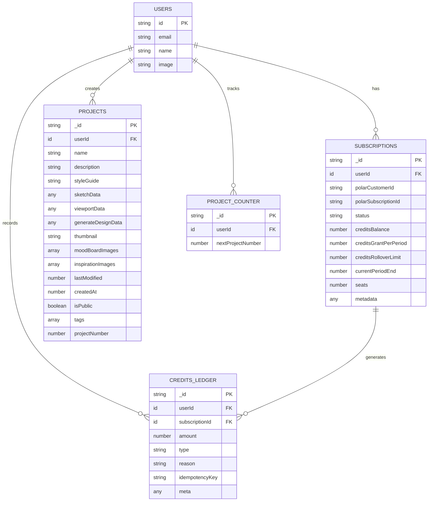

# Database Documentation - Convex Tables

## Table of Contents
- [Creating Tables in Convex - Procedure](#creating-tables-in-convex---procedure)
- [Custom Tables Overview](#custom-tables-overview)
- [Table Relationships Diagram](#table-relationships-diagram)
- [Detailed Table Structures](#detailed-table-structures)

## Creating Tables in Convex - Procedure

### Step 1: Define Schema Structure
In your `convex/schema.ts` file, use the `defineSchema` and `defineTable` functions:

```typescript
import { defineSchema, defineTable } from "convex/server";
import { v } from "convex/values";

const schema = defineSchema({
  // Your tables go here
  tableName: defineTable({
    // Define fields with validation
    field1: v.string(),
    field2: v.number(),
    field3: v.optional(v.boolean()),
    // ... more fields
  })
});
```

### Step 2: Add Indexes for Performance
Add indexes for frequently queried fields:

```typescript
tableName: defineTable({
  // ... fields
}).index("by_fieldName", ["fieldName"])
  .index("by_multipleFields", ["field1", "field2"])
```

### Step 3: Deploy Schema Changes
Run the following command to deploy your schema:

```bash
npx convex dev
# or for production
npx convex deploy
```

### Step 4: Create Mutation/Query Functions
Create corresponding functions in your Convex functions:

```typescript
// In convex/tableName.ts
export const create = mutation({
  args: { /* validation schema */ },
  handler: async (ctx, args) => {
    return await ctx.db.insert("tableName", args);
  }
});

export const getByUserId = query({
  args: { userId: v.id("users") },
  handler: async (ctx, { userId }) => {
    return await ctx.db
      .query("tableName")
      .withIndex("by_userId", (q) => q.eq("userId", userId))
      .collect();
  }
});
```

## Custom Tables Overview

### 📊 Database Schema Visualization

```
┌─────────────────┐    ┌─────────────────┐    ┌─────────────────┐
│     USERS       │    │  SUBSCRIPTIONS  │    │ CREDITS_LEDGER  │
│   (Auth Table)  │────│                 │────│                 │
└─────────────────┘    │  - userId       │    │  - userId       │
                       │  - planCode     │    │  - amount       │
                       │  - status       │    │  - type         │
                       │  - credits      │    │  - reason       │
                       └─────────────────┘    └─────────────────┘
                              │                        
                              │                        
┌─────────────────┐    ┌─────────────────┐    ┌─────────────────┐
│   PROJECTS      │    │ PROJECT_COUNTER │    │                 │
│                 │────│                 │    │                 │
│  - userId       │    │  - userId       │    │                 │
│  - name         │    │  - nextNumber   │    │                 │
│  - sketchData   │    │                 │    │                 │
│  - designData   │    └─────────────────┘    │                 │
└─────────────────┘                           └─────────────────┘
```

## Table Relationships Diagram




### 🔑 Auth Tables (Built-in)
Convex Auth provides standard authentication tables:
- **users**: User accounts and profiles
- **authSessions**: Active user sessions  
- **authAccounts**: OAuth provider connections
- **authVerificationCodes**: Email/phone verification

## Notes
- All tables use Convex's built-in `_id` field as primary key
- Timestamps are stored as numbers (Unix timestamps)
- Optional fields are marked with `?` in type definitions
- The schema supports the SaaS credit system with Polar payment integration
- Project data includes both sketch input and generated design output
